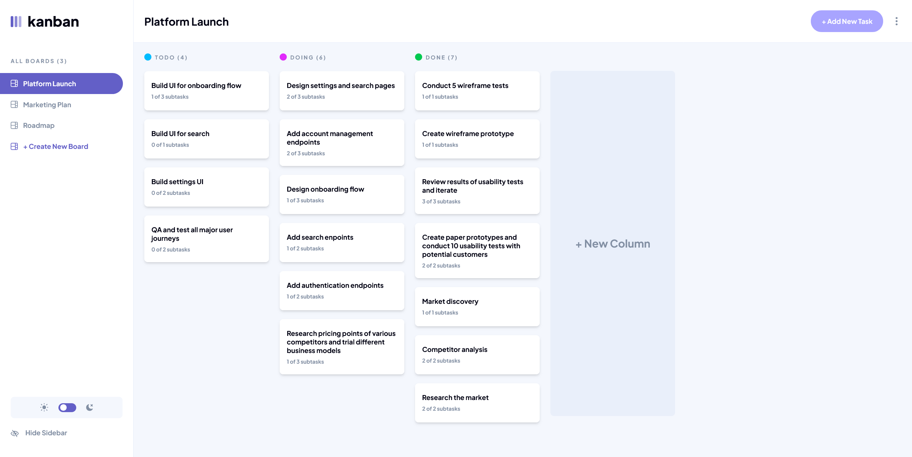

# Frontend Mentor - Kanban task management web app solution

This is a solution to the [Kanban task management web app challenge on Frontend Mentor](https://www.frontendmentor.io/challenges/kanban-task-management-web-app-wgQLt-HlbB).

## Table of contents

- [Overview](#overview)
  - [The challenge](#the-challenge)
  - [Screenshot](#screenshot)
  - [Links](#links)
- [My process](#my-process)
  - [Built with](#built-with)
  - [What I learned or practiced](#what-i-learned)
  - [Continued development](#continued-development)
  - [AI Collaboration](#ai-collaboration)

## Overview

### The challenge

Users should be able to:

- View the optimal layout for the app depending on their device's screen size
- See hover states for all interactive elements on the page
- Create, read, update, and delete boards and tasks
- Receive form validations when trying to create/edit boards and tasks
- Mark subtasks as complete and move tasks between columns
- Hide/show the board sidebar
- Toggle the theme between light/dark modes
- **Bonus**: Allow users to drag and drop tasks to change their status and re-order them in a column
- **Bonus**: Keep track of any changes, even after refreshing the browser (`localStorage` could be used for this if you're not building out a full-stack app)
- **Bonus**: Build this project as a full-stack application

### Screenshot



### Links

- Live Site URL: (https://kanban-task-management-web-app-64.netlify.app/)

## My process

### Built with

- HTML
- CSS
- JavaScript
- [React](https://reactjs.org/)
- [Tailwind](https://tailwindcss.com/)
- [TypeScript](https://www.typescriptlang.org/)

### What I learned or practiced

- Using HTML, CSS, JavaScript, React, Tailwind and TypeScript
- Responsiveness & Accessibility
- Creating and using custom Tailwind typography classes
- Handling the website theme (light mode and dark mode)
- Handling the website layout
- Creating context with custom hooks and using context
- Handling JSON data in state and manipulating the data in state in several ways
- Assinging IDs to objects and using them for greater accuracy when modifying data
- Using react-focus-trap to trap focus when a modal is open and to restore focus when closed
- Handling the escape key when modals are open to close them
- Handling outside clicks when modals are open and also within the modals themselves when sub menus are open
- Creating a darkened screen effect when modals are open
- Using svg?react to import svgs as components and control styling
- Using matchMedia to automatically close mobile menu on screen size change
- Formatting HTML/CSS more cleanly
- Creating a toggle switch component
- Controlling form inputs with state variables and onChange
- Handling custom form error messages, dynamic custom form error messages and form input error styling
- Creating dynamic components (TaskModal, BoardModal) that render the appropriate child component depending on user input

Some code snippets:
```js
    return (
        <button 
            onClick={ () => setDarkMode(!darkMode) } 
            className={`
                flex items-center w-10 h-5 p-1 bg-dark-purple rounded-full cursor-pointer transition hover:bg-light-purple
            `}
            aria-label="Toggle dark mode"
            aria-pressed={darkMode}
        >

            <div 
                className={`
                    w-3.5 h-3.5 bg-white rounded-full transition
                    ${darkMode ? "translate-x-4.5" : "translate-x-0"}
                `}
            />
        </button>
    )
```
```js
        setBoards( (prevBoards) => 
            prevBoards.map( (board) => {
                if (board.id !== activeBoard?.id) {
                    return board
                }

                return {
                    ...board,
                    columns: board.columns.map( (column) => {
                        if (column.id !== targetColumn?.id) {
                            return column
                        }

                        return {
                            ...column,
                            tasks: [...column.tasks, newTask]
                        }
                    })
                }
            })
        )
```
```js
    function handleTitleChange(value: string) {
        setTitle(value)
        
        if (formErrors.title) {
            setFormErrors( (prevFormErrors) => {
                const {title, ...rest} = prevFormErrors
                
                return {
                    ...rest
                }
            })
        }
    }
```
```js
    function handleSubmit(e: React.SubmitEvent<HTMLFormElement>) {
        e.preventDefault()
        
        let newErrors: TaskFormErrors = {}

        if (!title) { newErrors.title = "Can't be empty" }
        if (!description) { newErrors.description = "Can't be empty" }
        subtasks.forEach( (subtask) => {
            if (!subtask.title) {
                newErrors[`subtask-${subtask.id}`] = "Can't be empty"
            }
        })

        setFormErrors(newErrors)
        
        if (!title || !description || !targetColumn || subtasks.some( (subtask) => !subtask.title)) {
            return
        }

        onSubmit( {title, description, targetColumnId, subtasks} )
    }
```

### Continued development

- Unsure of best way to handle drag and drop, further research required for implementation in future projects

### AI Collaboration

- ChatGPT was useful for insight on how to approach certain aspects of the project, learning to build some of the more complex logic and particularly for debugging TypeScript errors